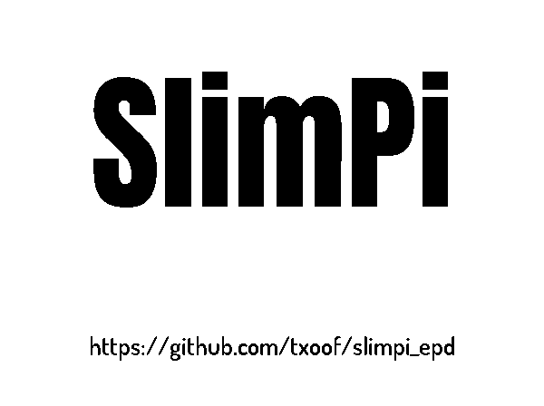

<!-- START doctoc generated TOC please keep comment here to allow auto update -->
<!-- DON'T EDIT THIS SECTION, INSTEAD RE-RUN doctoc TO UPDATE -->
# SlimPi - ePaper based Logitech Media Player Display


**Table of Contents**  *generated with [DocToc](https://github.com/thlorenz/doctoc)*

- [Introduction](#introduction)
- [Configure HiFi Berry](#configure-hifi-berry)
- [Setup Python Environment](#setup-python-environment)
  - [Requirements](#requirements)
- [Notes & Useful Links](#notes--useful-links)

<!-- END doctoc generated TOC please keep comment here to allow auto update -->

## Introduction
SlimPi provides a Logitech Media Player display using a [WaveShare](https://www.waveshare.com/product/oleds-lcds/e-paper.htm)


### Supported WaveShare ePaper Displays
All WaveShare ePaper displays should work with SlimPi, but only in 1 bit (black/white) mode. Only landscape mode is suported currently.
**Tested Displays**
* epd5in83


## Configure HiFi Berry
See [HiFi Berry guide](https://www.hifiberry.com/docs/software/configuring-linux-3-18-x/)
- disable onboard sound in /boot/config.txt
  * `#dtparam=audio=on`
- add load device tree overlay file in /boot/config.txt
  * `dtoverlay=hifiberry-dacplus`
- configure ALSA by creating /etc/asound.conf
```
pcm.!default {
  type hw card 0
}
ctl.!default {
  type hw card 0
}
```
 * make sure no .asound.conf file exists in user home directory

## Setup Python Environment
### Requirements
- Debian Packages -- install with apt
  * libtiff5-dev libopenjp2-7-dev

- Python Libraries -- install with pipenv
  * RPi.GPIO
  * spidev
  * Pillow
- WaveShare -- not sure best way to manage yet install with pipenv -- this is a fork of the library with the RaspberryPi directory renamed to remove the ampersand (&) character
  * `pipenv install -e "git+https://github.com/txoof/e-Paper.git#egg=waveshare-epd&subdirectory=RaspberryPi_and_JetsonNano/python/"`


## Notes & Useful Links
[Pi Pinout](https://pinout.xyz/pinout/pin1_3v3_power)
